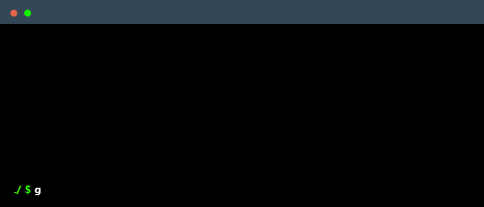

# Overview
*Git utility scripts*

# Installation
1. Place these scripts in a persistent location.
2. Add the location to `PATH`.

```
mkdir -p ~/.local/bin; \
    git clone https://github.com/AndrewMJordan/git-tools ~/.local/bin/git-tools; \
    export PATH="$PATH:$HOME/.local/bin/git-tools";
```

## Git Browse
*Opens the repository in your default web browser*

Note: only GitHub, GitLab, and BitBucket remotes are supported

> The environment variable `BROWSER` must be set.


## Git Bump
*Manages tags using semantic versioning*



## Git Is
*Prints whether the current directory is in a git repository*

## Git Lazy
*Commits all modified + untracked files*

## Git List
*Prints all git repositories in the current directory (and all child directories)*

## Git Produce
*Creates (or updates) a production branch from main, then pushes the branch*

> See [GitLab Flow](https://docs.gitlab.com/ee/topics/gitlab_flow.html#production-branch-with-gitlab-flow)

## Git Publish
*Pushes the branch to `origin` and sets up remote tracking*
```
$ git publish [-c|--create [-a|--merge-when-pipeline-succeeds]]
```

| Option | Description |
| --- | --- |
| `create` | Creates a merge request for this branch. The merge request details are formatted for [automatic issue closing](https://docs.gitlab.com/ee/user/project/issues/managing_issues.html#closing-issues-automatically). |
| `merge-when-pipeline-succeeds` | Automatically merges the merge request if the pipeline succeeds. |

> See [GitLab push options](https://docs.gitlab.com/ee/user/project/push_options.html) for more information.

## Git Deposit
*Clones a repository to a fixed location*

For example, running `git deposit https://gitlab.com/group/subgroup/project.git` would clone the repository to `~/repos/gitlab/group/subgroup/project`.

<details>
  <summary>FAQ: Why isn't the path shortened?</summary>
  
  Git can be configured to apply different settings depending on the path to the repository (see [gitconfig conditional includes](https://git-scm.com/docs/git-config#_conditional_includes)). By keeping the full path, Git can correctly examine the path and determine which settings to apply.
	
  For example:
  ```
  [includeIf "gitdir:**/FangCompany/**"]
        path = ~/work.gitconfig
  [includeIf "gitdir:**/MyPersonalCompany/**"]
        path = ~/home.gitconfig
  ```
</details>

### Advanced Setup
If environment variable `XDG_REPOS_HOME` is set, the repository is cloned to `XDG_REPOS_HOME`. Otherwise, the repository is cloned to `~/repos`.

> More on `XDG` environment variables [here](https://specifications.freedesktop.org/basedir-spec/latest/ar01s03.html)

## Git Who Am I
*Prints git-related user information based on the current directory*

## Git Feature (Experimental)
*Manages feature branches*

```
$ git feature start foo
$ git feature drop foo
$ git feature prune
```


## Git Sweep (Experimental)
*Synchronizes the local repository with the remote*
